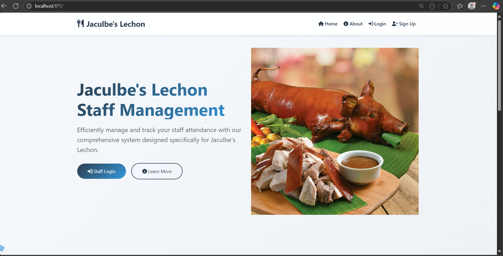
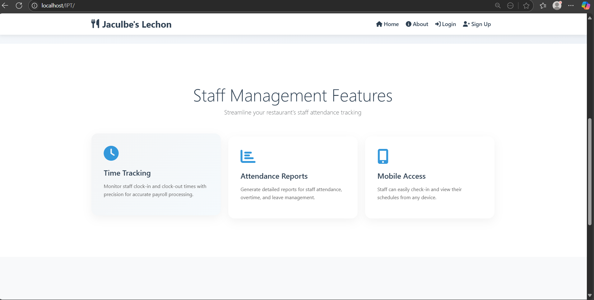
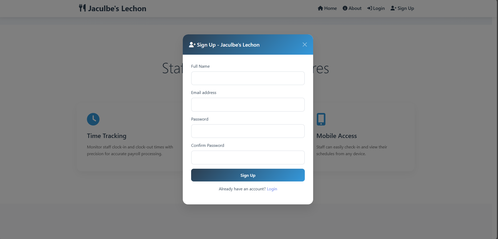
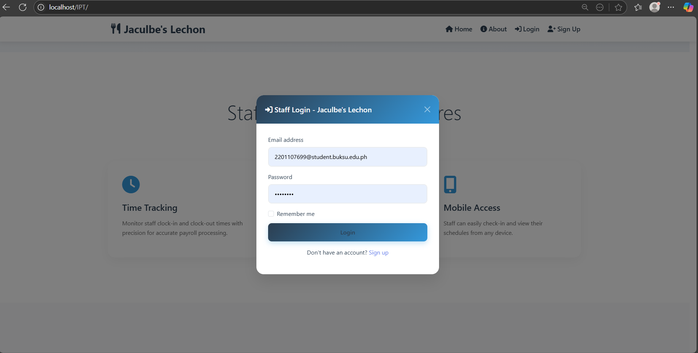
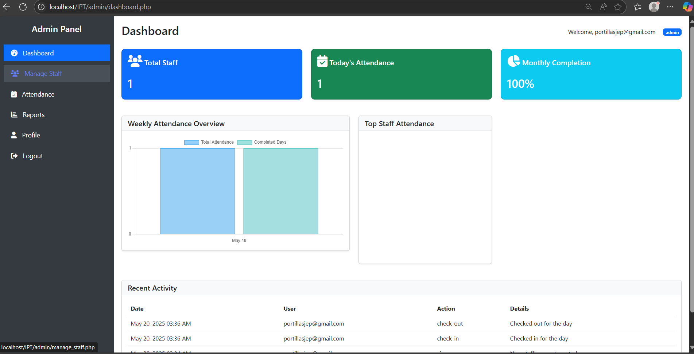
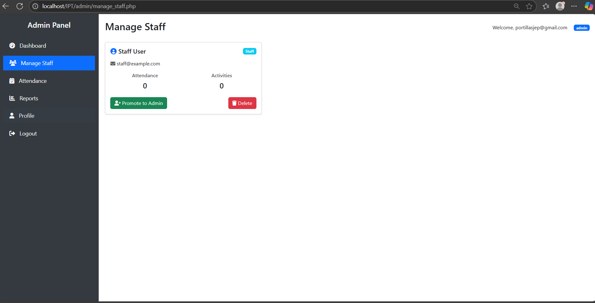
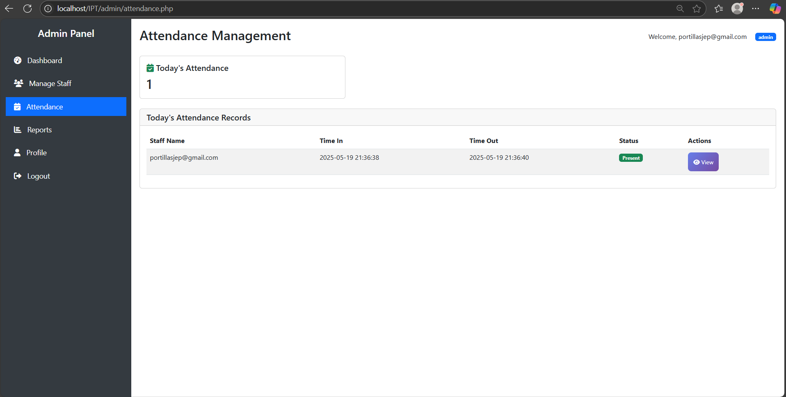
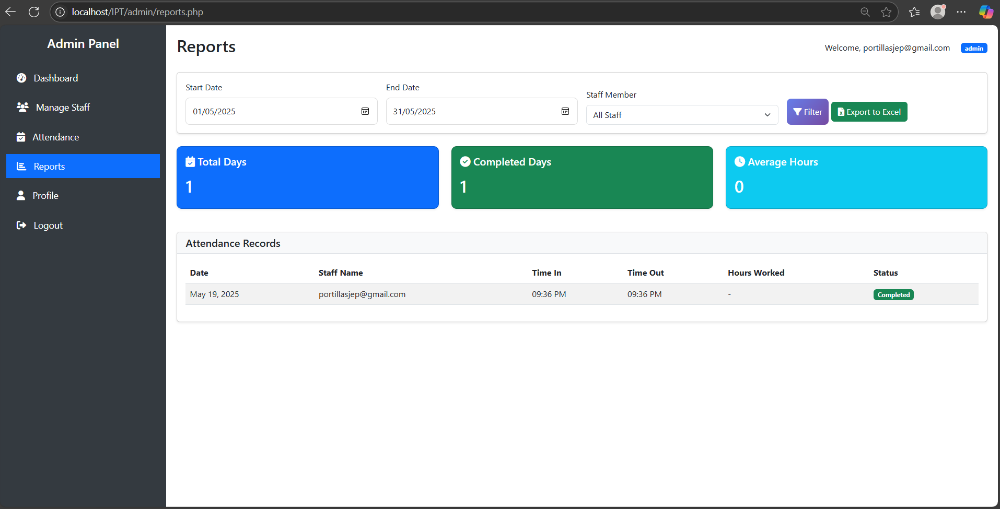

# 📌 DTR Management System (Lechon Organization)

A **web-based Daily Time Record (DTR) Management System** built using **PHP, MySQL, Bootstrap, CSS, and JavaScript**, tailored specifically for **Lechon organizations**. This system automates attendance tracking and streamlines time record management with role-based access for **Admin** and **Staff** users.

---

## 🔐 User Roles

### 👨‍💼 Admin
- 📊 Dashboard overview
- 👥 Manage staff accounts
- 📄 View, edit, delete attendance records
- 📅 Generate attendance reports (Daily, Weekly, Monthly)
- ⏱️ Set and update time-in/time-out rules

### 👷 Staff
- 🕒 Time-in / Time-out logging
- 📜 View personal DTR history
- ✏️ Edit own profile

---

## 🛠️ Tech Stack

| Tech        | Description             |
|-------------|-------------------------|
| **PHP**     | Backend scripting       |
| **MySQL**   | Relational database     |
| **Bootstrap** | Responsive UI design |
| **CSS3/JS** | Styling & Interactivity |
| **HTML5**   | Page structure          |

---

## 🚀 Installation Guide

## 📸 Preview

---

---

---

---

---

---

---

---
